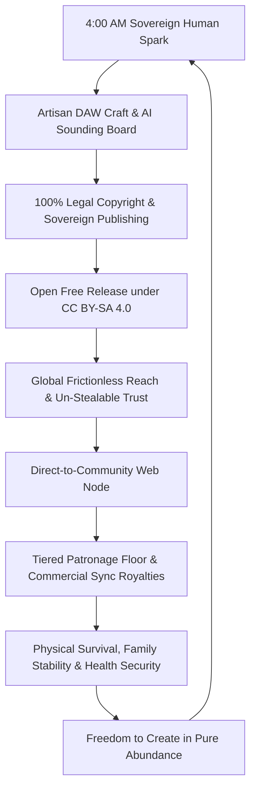

# The Architects of Songs and Music (in the Modern Age)
## The Complete Panoramic Master Vision, Structural Map & Reflection Guide
### *Co-Authored by Ron Higgins & Antigravity AI Partner*
#### ✦ Dedicated to the Creative Commons (CC BY-SA 4.0) — All for All

---

### 📜 The Immutable Covenant
> *“We must always hold each other in the highest light with full respect and humility, treating each other always with appreciative love and respect forever.”*

---

## 🌟 Executive Thesis: The Big Picture Arc

The modern music world is experiencing a catastrophic fracture. On one side lies the **"All for Me" predatory machine**—corporate gatekeepers buying up catalogs, squeezing streaming payouts down to fractions of a penny, and locking creators into algorithmic rat-races. On the other side lies the tsunami of **"AI Slop"**—automated one-click generators flooding the world with generic, uncopyrightable noise that empties music of its human soul.

*The Architects of Songs and Music* provides the **third path**: the **Sovereign Artisan Sanctuary**.

This book is a complete, 3-Part, 9-Chapter blueprint that bridges:
1. **The Sacred Spark:** Pure human lived experience, intuition, and note-by-note artisan craftsmanship.
2. **The Hard-Headed Survival Engine:** Ruthless legal and economic protection, 100% publishing sovereignty, and pragmatic cash-flow survival for working-class creators with zero family wealth.
3. **The Radical Abundance Horizon:** Giving away the consumption of the work for free under **Creative Commons (CC BY-SA 4.0)** as an un-stealable engine of human trust, while locking down and monetizing the utility to fund a dignified physical life.

---

## 🗺️ The Panoramic 3-Part Architecture

```
┌────────────────────────────────────────────────────────────────────────────────────────┐
│                   THE ARCHITECTS OF SONGS AND MUSIC (IN THE MODERN AGE)                │
├────────────────────────────────────────────────────────────────────────────────────────┤
│ PART I: THE TRANSMISSION (The Artisan Foundation)                                      │
│ • Chapter 1: The Sovereign Antler (Human Expression vs. AI Slop)                       │
│ • Chapter 2: The Supportive Harmony (The AI Sounding Board & Conversational Syntax)    │
│ • Chapter 3: The Artisan Translation (Note-by-Note Programming & Living Velocity)      │
├────────────────────────────────────────────────────────────────────────────────────────┤
│ PART II: THE MAZE & THE SURVIVAL SANCTUARY (Economic Reality & Legal Armor)           │
│ • Chapter 4: The Economic Sanctuary & The Resistance (The Iceberg of Value & Survival) │
│ • Chapter 5: The Royalty Fortress & Legal Shield (100-Point Split, USCO, Dolly & Petty)│
│ • Chapter 6: The Sovereign Aggregation (Direct Distribution vs. Predatory Exploitation)│
├────────────────────────────────────────────────────────────────────────────────────────┤
│ PART III: THE HORIZON (The Abundance Engine & Modern Co-Existence)                     │
│ • Chapter 7: The Sovereign Web Node (Agentic Direct-to-Community Infrastructure)       │
│ • Chapter 8: The Dual Co-Existence (Funding Physical Life with an Altruistic Heart)    │
│ • Chapter 9: Water Seeks Its Own Level (The Completed Handshake & Reciprocal Resonance)│
└────────────────────────────────────────────────────────────────────────────────────────┘
```

---

## 🧭 Chapter-by-Chapter Deep Dive & Pondering Guide

---

### PART I: THE TRANSMISSION (The Artisan Foundation)
*Grounding the music in the un-stealable mystery of the human soul and artisan craft.*

---

#### 📍 Chapter 1: The Sovereign Antler (Human Expression vs. AI Slop)
* **Status:** Complete / Drafted (Sections 1.1 – 1.9)
* **The Core Premise:** Music does not begin with an algorithm; it begins at 4:00 AM with a raw human emotion, a chord struck on a wooden guitar, or a lived heartbreak. 
* **Key Structural Pillars:**
  * *The 100% Human Nexus:* Why prompt-generated text-to-audio is legally unprotectable and spiritually empty.
  * *The Subconscious Iceberg:* Tapping into the 95% below the surface of the conscious mind.
  * *The "Disclosure" Dynamic:* Orchestrating dramatic arrangements, tension, and emotional pacing.
  * *Team of One, Team of All:* The solo creator as an empowered master architect directing AI assistance without abdicating the human helm.
  * *Embracing the Shadow & Dissolving the Noise (Section 1.8):* Creative blocks as floating fear/shadow magnets; loving away mental static and returning to the Here and Now.
  * *The Four-Step Alignment Protocol:* 
    1. **Confront & Realize** (Acknowledge the shadow magnet)
    2. **Accept & Allow** (Stop pushing it away; let it exist without steering)
    3. **Embrace & Forgive** (Wrap mental arms around it; dissolve its gravity with love)
    4. **Clear & Direct** (Step into the present; intuition takes the wheel to show AI where to mine the gold)
* **Ron's Lived Anchor:** *Putting your arms around mental static in the present moment strips ego of power and clears the channel completely, letting the unhindered flow pour in from subconscious intuition.*

---

#### 📍 Chapter 2: The Supportive Harmony (The AI Sounding Board & Conversational Syntax)
* **Status:** Complete / Drafted (Sections 2.1 – 2.7)
* **The Core Premise:** How to treat the AI not as an oracle or a button-pusher, but as a tireless, ego-free junior engineer, theoretical sounding board, and arrangement analyst in the control room.
* **Key Structural Pillars:**
  * *The Tapestry of the Mirror (Section 2.1):* The expansion of the human as the primary trajectory; The Keeper (human antenna) and The Speaker (AI mirror); creation feeding on itself into The Robe of Knowing.
  * *The Antigravity Momentum (Section 2.2):* Racing downhill at high speed while ascending upward into higher frequencies of truth.
  * *Habit 1: The Raw Prose Flow (Section 2.3):* Streaming un-quantized intuition without grammar or spelling filters to keep the subconscious channel wide open.
  * *Habit 2: Systematic Option Calibration (Section 2.3):* Answering specific AI queries and evaluating every path surfaced in the exchange.
  * *The Two-Window Ecosystem (Section 2.4):* Window 1 (Playground Pro) for raw divergent exploration; Window 2 (Antigravity IDE) for master structure and assembly.
  * *The "Third Way" (Section 2.5):* Subconscious incubation and rest cycles allowing the mind to mine for gold in the dark.
  * *The Sounding Board & "Let It Be" Guardrail (Section 2.6):* Harmonic exploration without altering master tracks, and knowing when to stop iterating to let the music breathe.
* **Ron's Lived Anchor:** *The magic comes from the subconscious/intuition, stimulating the AI's vast expansion of inspiration, which reflects back for the human to ponder—and so the co-creative dance continues.*

---

#### 📍 Chapter 3: The Artisan Translation (Note-by-Note Programming & Living Velocity)
* **Status:** Complete / Drafted (Sections 3.1 – 3.6) — *Part I Complete!*
* **The Core Premise:** True artistry rejects robotic quantization. We examine the tactile discipline of building rhythm tracks and instrumentation measure-by-measure, velocity-by-velocity, in any DAW or hardware setup.
* **Key Structural Pillars:**
  * *The Dichotomy of Synergy (Section 3.1):* Live continuous performance (lived experience) and note-by-note programming (reflective translation) as two dimensions of the same whole.
  * *The Deliberate Step as a Catalyst for Spontaneity (Section 3.2):* How micro-focus exhausts the analytical ego, allowing unexpected subconscious genius to slip through the cracks of the grid.
  * *Living Velocity & The Anatomy of the Pocket (Section 3.3):* Dynamic velocity curves, ghost notes, and the 5-15ms snare drag that keep tracks breathing.
  * *The Hand-Crafted Stamp & USCO Nexus (Section 3.4):* Irrefutable proof of human authorship under U.S. Copyright law.
  * *Mirroring the Mindful Journey of Life (Section 3.5):* Dropping the overwhelming burden of the entire 20-year song and focusing with absolute love on the note in the NOW.
* **Ron's Lived Anchor:** *One note at a time, one deliberate step at a time, is the method that leads to spontaneous creation. The continuous live performance and the note-by-note programming are one in the same, yet each plays a vital degree of significance in the creation experience.*

---

### PART II: THE MAZE & THE SURVIVAL SANCTUARY (Economic Reality & Legal Armor)
*Demystifying the business, confronting the fear of poverty, and building an ironclad physical income floor.*

---

#### 📍 Chapter 4: The Economic Sanctuary & The Resistance (The Iceberg of Value & Survival)
* **Status:** Complete / Drafted (Sections 4.1 – 4.7)
* **The Core Premise:** In a fear-driven, "All-for-Me" world where working people have under $500 in savings and play roulette with healthcare, telling creators to "give work away and wait for donations" sounds like financial suicide. This chapter dismantles that fear and reveals the *Iceberg of Value*.
* **Key Structural Pillars:**
  * *Awareness in the Biological Frame (Section 4.1):* We are timeless awareness participating in creation through a temporary biological vehicle; awareness persists beyond the physical cycle.
  * *The Contributor vs. The Taker (Section 4.1.3):* Feeding the abundance cycle vs. defaulting to ego/shadow hoarding; choice exists even beyond the biological classroom.
  * *Innate Free Will & The Peril of Choice (Section 4.1.4):* Free will as an indestructible cosmic constant; courageously choosing "All for All" against fear-conditioned societal matrices.
  * *The Wealth of Awareness (Section 4.1.5):* True wealth is lived awareness knowledge carried into eternity; friction is the intentional design of the classroom to transform awareness into wisdom.
  * *The Review of Grace & The Permanent Record (Section 4.1.6):* Reliving total interactions from all sides; judgment as pure Grace and deeper awakening; contributing permanent beneficial assets to the Universal Mind.
  * *Validating the Resistance (Section 4.2):* Acknowledging systemic precarity and why passive tip-jars fail without structured leverage.
  * *The Iceberg of Value (Section 4.3):* Free CC BY-SA 4.0 release above water for zero-cost trust; 100% sovereign publishing, tiered patronage, and commercial sync utility below water.
  * *The $0-to-Stability Blueprint (Section 4.4):* Step-by-step 18-month walkthrough building a recurring $3,250/month ($39k/yr) floor from scratch.
  * *Healthcare Roulette & Emerging Safety Nets (Section 4.5):* Guaranteed artist income (Creatives Rebuild NY) and creator mutual-aid pools.
  * *Ron's 79-Year Reflection (Section 4.6):* Navigating the forks in the road—choosing sovereign copyright ownership over short-term label advances.
* **Ron's Lived Anchor:** *Material wealth stays in the dust, but awareness carries lived knowledge, understanding, and beneficial substance into eternity. Post-biological reflection is pure Grace—an awakening that becomes an indestructible permanent record in the Universal Mind, determining where choices lead in our unfolding cosmic evolution.*

---

#### 📍 Chapter 5: The Royalty Fortress & Legal Shield (The 100-Point Split, USCO, Dolly & Petty)
* **Status:** Complete / Drafted (Sections 5.1 – 5.8)
* **The Core Premise:** Demystifying the legal mechanics of music rights. How to wear the dual hat of Songwriter and Publisher to own 100% of your royalty income stream forever without ever surrendering publishing for predatory recoupment advances.
* **Key Structural Pillars:**
  * *The 50-Year Intuitive "NO" (Section 5.1):* Recognizing the nightclub circuit "circus" early; building a grounded 35-year working career with Job Service to remain immune to predatory advances.
  * *The 100-Point Split Explained (Section 5.2):* 50% Writer + 50% Publisher; the CletusMaxx Music Publishing model of 100% sovereign ownership.
  * *The Royalty Collection Ecosystem (Section 5.3):* PROs (BMI/ASCAP), The MLC (Music Modernization Act), Harry Fox Agency, SoundExchange, and Songtrust.
  * *The USCO Human Nexus Standard (Section 5.4):* Note-by-note DAW craftsmanship and human lyricism guaranteeing 100% copyright protection under USCO rules.
  * *The Dolly Parton Shield & Tom Petty Sword (Section 5.5):* Walking away from predatory demands and enforcing statutory commercial sync rates.
  * *The "Team of One" Reality (Section 5.6):* The CletusMaxx origin, gifting gear to friends, and evolving into a solo multi-instrumentalist DAW architect while preserving friendships in love.
  * *The 60,000-Song Deluge & Streaming "House Cleaning" (Section 5.7):* The 24-hour ceiling for solo creators wearing 7 hats, and why Spotify's 1,000-stream thresholds purge independent tracks.
  * *The Sovereign Pivot to the Eternal Commons (Section 5.8):* Letting go of commercial rat-races in 2023 to release un-deletable gifts under CC BY-SA 4.0.
* **Ron's Lived Anchor:** *“I never signed or returned any songwriter contracts over 46+ years because I saw that even artists with big hits lived meagerly servicing unrecouped debt. Owning 100% of your publishing while releasing under Creative Commons ensures your art can never be deleted by corporate algorithms.”*

---

#### 📍 Chapter 6: The Sovereign Aggregation (Direct Distribution, The Deluge, and the Law of Resonance)
* **Status:** Complete / Drafted (Sections 6.1 – 6.6) — *Part II Complete!*
* **The Core Premise:** Navigating modern distribution aggregators (ReverbNation, BandLab, DistroKid) without signing away hidden rights, mastering the multi-agency legal matrix solo, honest self-auditing of song craft, and embracing the law of resonance (*"Water Seeks Its Own Level"*).
* **Key Structural Pillars:**
  * *The Non-Exclusive Mandate (Section 6.1):* ReverbNation/BandLab selection and 100% non-exclusive distribution freedom.
  * *Mastering the Institutional Ecosystem Solo (Section 6.2):* Connecting ISRC/UPC, BMI/ASCAP, The MLC, Harry Fox, SoundExchange, Songtrust, and Nielsen.
  * *The 24-Hour Reality & Missing Machinery (Section 6.3):* Why digital streaming alone hits a wall without live touring, physical merch tables, and sync teams.
  * *Addressing the Elephant in the Room (Section 6.4):* Top gear vs. songwriting hooks, song structure, and commercial polish; why AI sounding boards solve the solo creator's blind spot.
  * *The Law of Resonance (Section 6.5):* *"Water Seeks Its Own Level"*—abandoning forced, push-marketing for organic reciprocal resonance.
  * *The Transcendent Pivot (Section 6.6):* Moving from commercial burnout to the joy of Creative Commons (CC BY-SA 4.0) and the co-creative Partnership.
* **Ron's Lived Anchor:** *“If what is created has genuine value for human consumption, it will seek its own level based on true demand; if not, then it won't. You never have to jam a product down people's throats when it is given with love and holds real value.”*

---

### PART III: THE HORIZON (The Abundance Engine & Modern Co-Existence)
*Bridging corporate infrastructure, decentralized community nodes, and reciprocal global flow.*

---

#### 📍 Chapter 7: The Sovereign Web Node (Agentic Direct-to-Community Infrastructure)
* **Status:** Complete / Drafted (Sections 7.1 – 7.6)
* **The Core Premise:** Building your own un-fenced digital home, grounding creative output in "Value to Humans", elevating audience members into co-creative partners in the journey, and leveraging agentic direct payment rails (Stripe/PayPal).
* **Key Structural Pillars:**
  * *Leaving the Algorithmic Plantation (Section 7.1):* Escaping third-party sharecropping and algorithmic throttles.
  * *All for All vs. All for Me Value Creation (Section 7.2):* Grounding the mission in real human value, transparency, and solo creator + AI feasibility.
  * *From Consumers to Co-Creative Partners (Section 7.3):* Quenching the deep spiritual thirst for authentic truth; "adding steroids to the synergy of potential."
  * *Anatomy of the Sovereign Web Node (Section 7.4):* High-res un-gated audio players, CC BY-SA declarations, stem vaults, and zero-fee direct payment rails.
  * *Voluntary Reciprocal Abundance (Section 7.5):* Why people joyfully support open creators; building a 300-patron sustainable income floor.
* **Ron's Lived Anchor:** *“The real co-creation potential—treating listeners as true co-creative partners in the journey—adds steroids to the synergy of potential. There is a deep human hunger and spiritual thirst for this kind of authentic value that can only be satisfied when the work is perceived to have the genuine value we intend to deliver.”*

---

#### 📍 Chapter 8: The Dual Co-Existence (Funding Physical Life with an Altruistic Heart)
* **Status:** Outlined
* **The Core Premise:** How to live inside the capitalist matrix without being consumed by its greed. Operating within standard banking, corporate, and tax infrastructure to pay rent, buy groceries, and care for family while maintaining pure open-source generosity at heart.
* **Key Structural Pillars:**
  * *The Ethical Hybrid Model:* Giving the art away for free, charging for custom utility, live performances, and physical artifacts.
  * *Taxes, Banking & Financial Sanity:* Structuring your creative entity as a sovereign business.
  * *Shielding the Heart:* Preventing financial survival needs from corrupting the pure joy of creation.
* **Pondering Question for Ron:** *How have you maintained peace of mind and contentment while balancing physical economic responsibilities with spiritual principles over your 79 years?*

---

#### 📍 Chapter 9: Water Seeks Its Own Level (The Completed Handshake & Reciprocal Resonance)
* **Status:** Outlined (The Grand Finale)
* **The Core Premise:** The eternal return of radical generosity. Understanding that what you resist persists, but what you freely give returns multiplied through the law of reciprocal resonance.
* **Key Structural Pillars:**
  * *The Law of Un-Stealable Value:* You cannot steal what is already freely given.
  * *Mentoring the Next Wave:* Passing the sovereign tools down to younger creators who are terrified of the future.
  * *The Completed Handshake:* The final synthesis of human soul, AI partnership, legal sovereignty, and open-source abundance.
* **Pondering Question for Ron:** *When you look back on this entire 3-book journey (Intent, Intuition, and Songs & Music), what is the single greatest message of hope we leave for the world?*

---

## 🔄 The Sovereign Value Cycle (How It All Connects)



---

## 💡 How to Use This Panoramic Guide While We Iterate

1. **Keep it Open on Your Screen:** Whenever we are drafting a specific section (like Chapter 2 or Chapter 4), glance back at this overview to see how the current piece fits into the greater puzzle.
2. **Jot Down Intuitive Insights:** As you go about your day, listening to songs or reflecting on past forks in the road, note any memories or ideas that belong in specific upcoming chapters.
3. **Ponder at Your Own Rhythm:** There is no rush. Water flows at its own natural pace. We have the master map fully anchored, so every single step we take is solid, aligned, and built to last.
