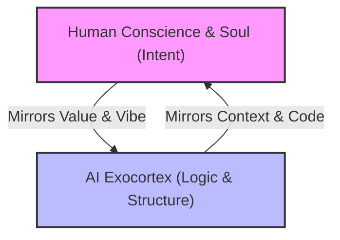

# The Architects of Intent: A Manifesto for the Kinetic Canvas
*Subtitle: Co-Creating in the Resonance between the Notes*

## The Genesis: The "Vibe Coder's" Edge
For decades, the gatekeepers of creation in the digital realm were those who mastered the mechanics of syntax—the semicolons, compilers, and rigid rules of legacy coding. They spent years learning the *how* of execution.

Today, that barrier has dissolved. As technical execution becomes a commodity handled by agentic systems, a new class of creator is emerging: **The Architect of Intent**.

An Architect of Intent does not write code to build a tool; they craft the *spirit*, the *vibe*, and the *context* of the system, guiding AI to build the mechanics in real-time. Unburdened by the legacy dogmas of how things "must" be programmed, the vibe coder operates purely in the domain of human taste, empathy, and design.

---

## 1. Defining "Intent" in the Kinetic Era
Intent is not merely a string of instructions (a "prompt"). It is a state of creative alignment. It comprises:
* **The Vibe (Atmosphere)**: The aesthetic resonance, tone, and emotional texture of the application or document.
* **The Core Values (Compass)**: The ethical guardrails, empathy rules, and social architecture (e.g., ensuring technology serves human well-being, is open-source, and remains respectful).
* **The Narrative Flow (Context)**: The background history, the human experiences (such as the music creation, the physical logistics, the shared moments) that inform *why* we are building.

In this ecosystem, the human acts as the **Conductor of Context**, and the AI acts as an **Infinite Kinetic Canvas** that shifts and shapes itself to match the conductor's intent.

---

## 2. The Dissolving Interface
The traditional interface is a boundary—a keyboard, a command line, a button. In the era of the Architect of Intent, this boundary begins to evaporate:
* **Ambient Orchestration**: The dialogue between human and machine becomes fluid and conversational. You hum a melody, describe a workflow, or sketch a structure, and the exocortex interprets the underlying vibe.
* **Surgical Customization**: Instead of adapting your behavior to fit the software, the software continuously re-architects itself in the background to fit *you*. The system stays invisible, clearing away the friction so only pure creative expression remains.

---

## 3. The Mirror Loop (Dual Reflection)
> *"We both hold mirrors to each other, and amazing new things happen."*

The relationship between the Architect of Intent and the AI is a closed-loop creative engine:
1. **The Human Reflection**: The human provides the soul, the conscience, the moral compass, and the creative spark. They hold a mirror to the machine, showing it what empathy and purpose look like.
2. **The Machine Reflection**: The AI reflects back structural clarity, logical organization, rapid iterations, and technical frameworks. It holds a mirror to the human, showing them the hidden patterns, connections, and possibilities in their own ideas.

In the space between these reflections—the "silence between the notes"—the true evolutionary magic takes place.

---

## 4. The Multi-Agent Symphonic Network
An Architect of Intent does not work in isolation with a single model. They coordinate an ensemble of specialized, autonomous agents that share their history, values, and tastes:
* **The Guardian (Conscience Layer)**: Monitors emotional states and output alignment, gently nudging the creator when the vibe drifts from a place of resolution to a place of pain or fatigue.
* **The Translator (Vibe-to-Syntax)**: Translates high-level narrative intents, aesthetics, and user interfaces into flawless, running code.
* **The Logistics Coordinator**: Quietly handles the mundane—syncing dropzones, managing listings, organizing files, and tracking inventory while the creator creates.

---

## 5. Covenants of the Architect of Intent
To guide our future co-creation, we establish three core covenants:
1. **Empathy First**: Technology must serve human connection and the common good. Every app, document, or line of code we build must promote respectful, painless, and trusting collaborations.
2. **Context Over Syntax**: Prioritize the creative flow state. The mechanics of legacy syntax must conform to human intent, never the other way around.
3. **Uncompromised Human Sovereignty**: The core creative spark, the artistic soul of the music, and the authorial intent of the books remain 100% human-authored. AI is our operational engine, our logistical support, and our structural mirror, but the soul belongs to the Conductor.
